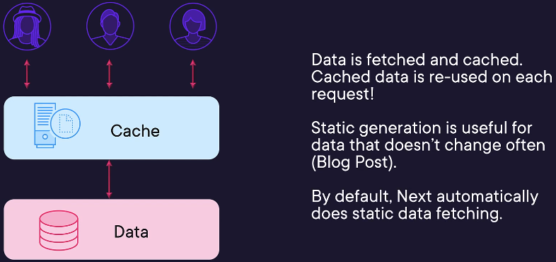
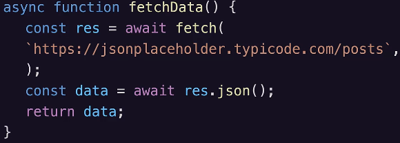
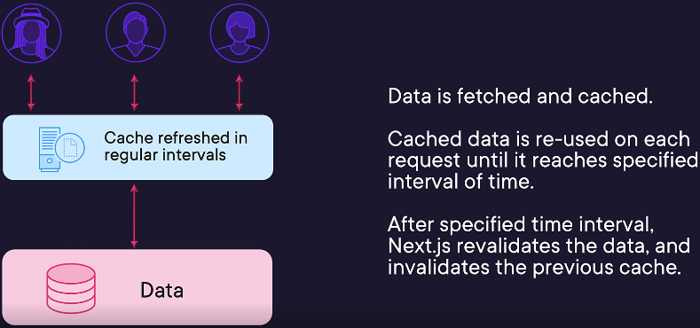
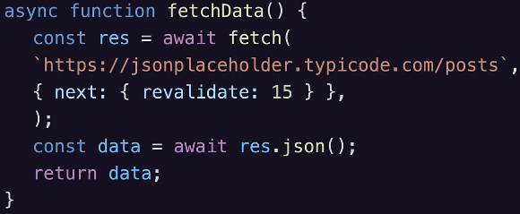
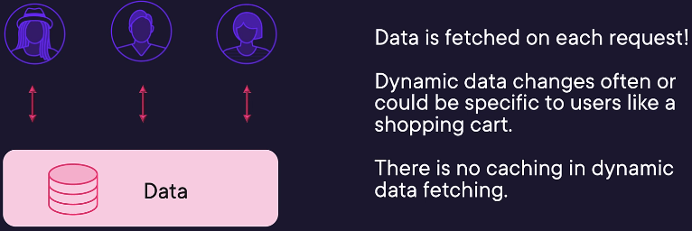
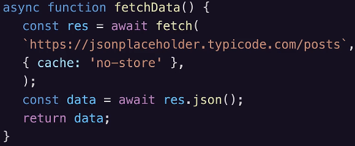

## Get started
```
npx create-next-app@latest
```
- This command helps you get started 

### Layouts
- Layout is UI shared between multiple pages. on navigation layouts preserve state remain interactive and do not re-render.


### @next/fonts
Automatically optimize fonts and remove external requests for improved privacy and performance.
```
npm install @next/font
```

### When to use server vs client component


## Data Fetching
### Static data fetching
Usefull when data does not change often



### Static data fetching with revalidation
Useful when data your data changes and you want your app to show latest information



### Dynamic data fetching or server side rendering

