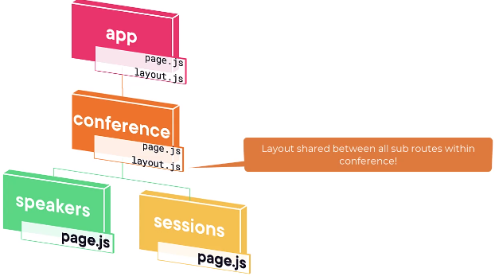
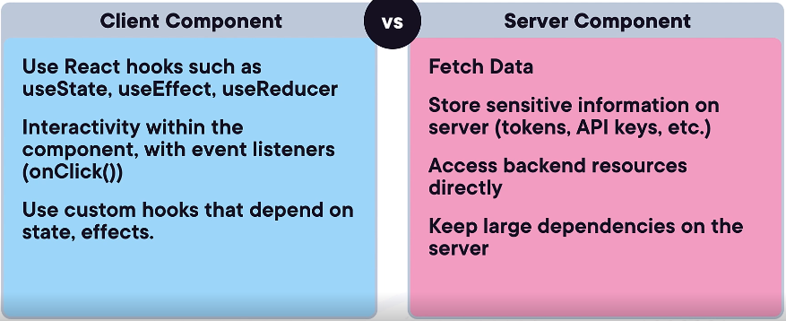

## Get started
```
npx create-next-app@latest
```
- This command helps you get started 

### Layouts
- Layout is UI shared between multiple pages. on navigation layouts preserve state remain interactive and do not re-render.


### @next/fonts
Automatically optimize fonts and remove external requests for improved privacy and performance.
```
npm install @next/font
```

### When to use server vs client component
